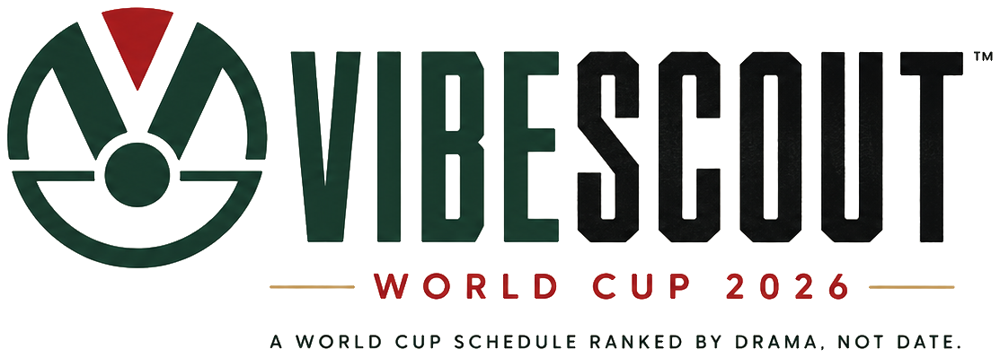

# VibeScout 2026

<p align="center">
  
</p>

<p align="center">
  A World Cup schedule ranked by drama, not date.
</p>

## What it is

VibeScout 2026 is a mobile-first World Cup companion that helps fans decide which matches are actually worth watching.

Instead of treating every fixture the same, the app ranks matches with a `Vibe Score /100` based on football value: stakes, balance, star power, upset risk, fan pull, and kickoff convenience for Morocco time.

This repo currently focuses on a polished mobile product slice:

- Home screen with the top recommendation
- Rankings page with searchable match cards
- Watchlist with local persistence
- Settings that affect app behavior

## What the app does today

- Highlights the best match to watch right now
- Shows the next best three matches on Home
- Ranks the World Cup fixture list by Vibe Score
- Explains why a match scored the way it did
- Lets users search by team or date
- Converts kickoff times to `Africa/Casablanca`
- Stores watchlist and settings in `localStorage`
- Supports reduced motion and mobile-friendly interaction

## Built with

- Next.js 15
- React 19
- TypeScript
- Tailwind CSS
- GSAP
- Lenis
- Lucide React

## Screens in this version

### `/`
Mobile Home screen with:

- logo and header actions
- hero recommendation
- archival football visual
- featured match ticket
- Vibe Score and explanation
- next best matches
- watchlist call-to-action

### `/rankings`

- full ranked fixture list
- search
- date filtering
- expandable match descriptions
- score breakdown details

### `/watchlist`

- saved matches
- quick remove / clear behavior
- empty state

### `/settings`

- Morocco time lock
- score preference selection
- hide overnight games
- hide passed games
- reduced motion
- clear watchlist

## Project structure

```text
app/
  api/world-cup/route.ts   Live update route with cache headers
  globals.css              Global styles, tokens, and component classes
  layout.tsx               Root app shell
  page.tsx                 Home route
  rankings/page.tsx        Rankings route
  settings/page.tsx        Settings route
  watchlist/page.tsx       Watchlist route

components/
  home-screen.tsx          Home experience
  rankings-screen.tsx      Rankings experience
  settings-screen.tsx      Settings experience
  watchlist-screen.tsx     Watchlist experience
  score-breakdown.tsx      Shared score explanation UI
  match-state-pill.tsx     Match status badge

lib/
  matches.ts               Fixture data and editorial metadata
  match-intelligence.ts    Home slate and match selection logic
  preference-scoring.ts    Score reweighting by user preference
  live-world-cup.ts        Live patch fetching and client caching
  settings.ts              Settings state and persistence
  watchlist.ts             Watchlist state and persistence

public/
  brand/                   VibeScout logo assets
  images/                  Hero/editorial imagery

PRODUCT.md                 Product purpose and scope
BRAND.md                   Brand voice and identity rules
DESIGN.md                  Visual system and UI rules
CRAFT.md                   Motion, quality, and implementation bar
```

## Getting started

### 1. Install dependencies

```bash
npm install
```

### 2. Run the dev server

```bash
npm run dev
```

Open [http://localhost:3000](http://localhost:3000).

### 3. Run checks

```bash
npm run typecheck
npm run lint
npm run build
```

## Data notes

- The app uses local World Cup fixture data plus live update support through `app/api/world-cup/route.ts`.
- Flags are loaded as image assets from a free flag CDN.
- Match ranking is editorial and deterministic inside the app.
- The score is a watchability score, not a prediction model and not betting advice.

## Settings behavior

These settings are not decorative; they affect app behavior:

- `Score Preferences` reweight visible scores and rankings
- `Hide overnight games` filters matches before `07:00` Morocco time
- `Hide passed games` filters matches whose kickoff has already passed
- `Reduced motion` tones down motion behavior
- `Clear watchlist` removes saved matches from local storage

## Design direction

The product aims for:

- warm off-white editorial surfaces
- condensed football typography
- premium mobile polish
- collectible ticket-card energy
- subtle motion, not noisy motion

It intentionally avoids:

- generic sports dashboards
- betting app aesthetics
- dark neon "crypto" UI
- ESPN/FIFA clone behavior

## Current limitations

This is still a focused product slice, not the full platform.

Not in this version yet:

- auth
- backend persistence
- desktop-first layouts
- full team pages
- real multi-page filtering system
- full live match coverage UX
- production deployment config

## Notes for contributors

- Keep the app mobile-first.
- Respect the existing brand docs before changing UI direction.
- Prefer calm editorial polish over feature noise.
- Any score UI must always show both a number and a text label.
- Reduced motion support is part of the product, not an optional extra.

## Credits

Built by eybiwon (Abdelouahed).

Follow the project on GitHub:
[Abdelouahedb/vibescout-world-cup-2026](https://github.com/Abdelouahedb/vibescout-world-cup-2026)
